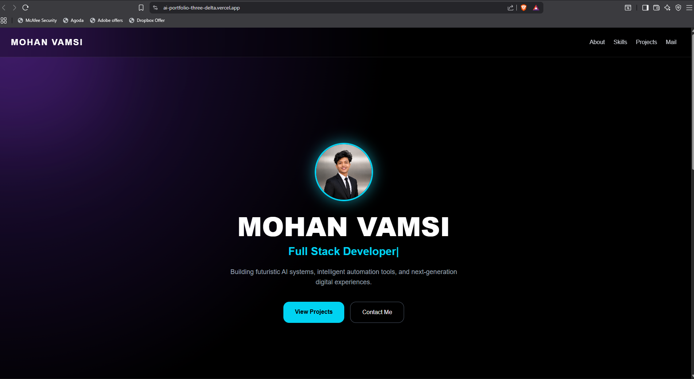
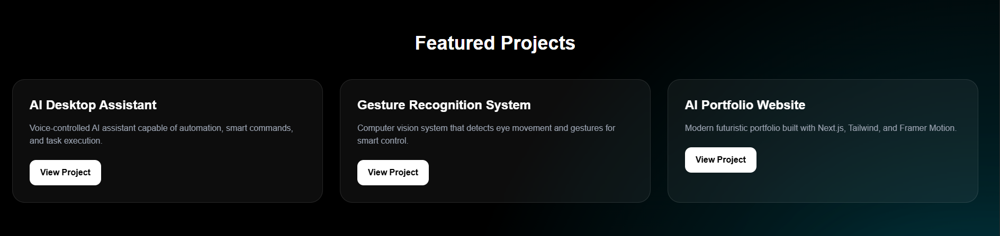
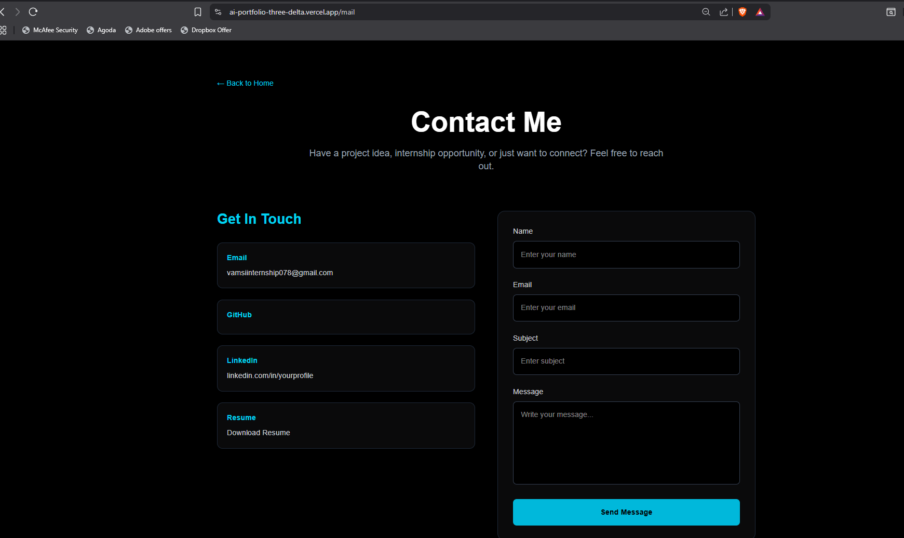

# AI Portfolio Website

## Overview

This is my personal portfolio website built using Next.js, Tailwind CSS, and Framer Motion. The website showcases my technical skills, featured projects, career goals, resume, and contact information through a modern and responsive user interface.

The portfolio is designed to highlight my experience in Full Stack Development, Artificial Intelligence, Machine Learning, and Automation.

## Live Demo

https://ai-portfolio-three-delta.vercel.app/

## Features

* Modern Responsive Design
* Mobile-Friendly Navigation
* Dedicated About Page
* Dedicated Contact Page
* Resume Download
* Skills Showcase
* Featured Projects Section
* Framer Motion Animations
* Professional UI/UX
* Smooth Navigation

## Technologies Used

* Next.js
* React
* TypeScript
* Tailwind CSS
* Framer Motion
* Vercel

## Sections

### Home

Introduction, profile image, and call-to-action buttons.

### About

Personal journey, career goals, and professional overview.

### Skills

Technical skills and technology stack.

### Projects

Featured projects with descriptions and links.

### Contact

GitHub, LinkedIn, Email, and Resume access.

## Featured Projects

### AI Desktop Assistant

Voice-controlled AI assistant capable of automation, smart commands, and task execution.

### Gesture Recognition System

Computer vision system that detects eye movement and gestures for smart control.

### AI Portfolio Website

Modern portfolio built using Next.js, Tailwind CSS, and Framer Motion.

## Project Structure

portfolio/
├── app/
│   ├── about/
│   ├── contact/
│   ├── page.tsx
│   ├── layout.tsx
│   └── globals.css
│
├── public/
│   ├── profile.png
│   └── resume.pdf
│
├── screenshots/
│   ├── portfolio-home-desktop.png
│   ├── portfolio-home-mobile.png
│   ├── portfolio-projects.png
│   └── portfolio-contact.png
│
├── README.md
├── package.json
└── ...

## Installation

### Clone the repository

git clone https://github.com/A-MOHAN-VAMSI/AI-Portfolio.git

### Navigate to the project folder

cd portfolio

### Install dependencies

npm install

### Run the development server

npm run dev

### Open in browser

http://localhost:3000

## Screenshots

### Home Page (Desktop)

### Home Page (Mobile)

### Projects Section

### Contact Page

## Author

Mohan Vamsi

GitHub:
https://github.com/A-MOHAN-VAMSI

LinkedIn:
https://www.linkedin.com/in/akula-mohan-vamsi-445a6936a/

## License

This project is created for educational, learning, and portfolio purposes.
